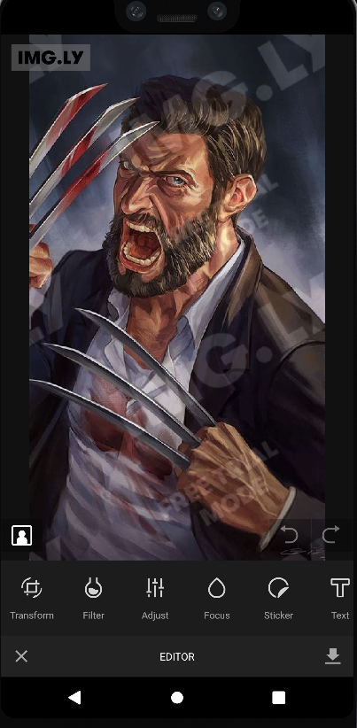

> [!NOTE]
> Still on Work.

	
	<h4 align="center">
	Lens It, Own It, Revolutionize It!
</h4>

## Introduction

Lencfy 🚀 – Your go-to photo editing tool. Lens It, Own It, Revolutionize your images with our intuitive software, empowering you to create stunning visuals effortlessly.

## Screenshots

<table>
<tr>
<td>

</td>
<td>

</td>
<td>

</td>
</tr>
<tr>
<td>

</td>
<td>

</td>
<td>

</td>
</tr>
</table>

***

Credit [IMG.Ly](https://img.ly/docs/pesdk/android/getting-started/integration/)
